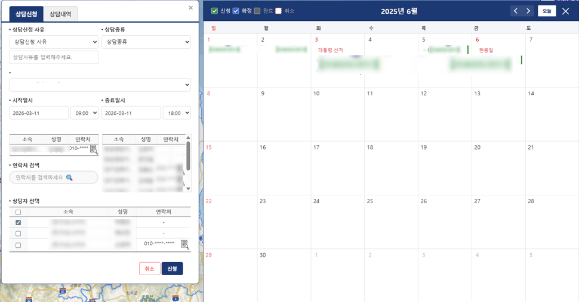
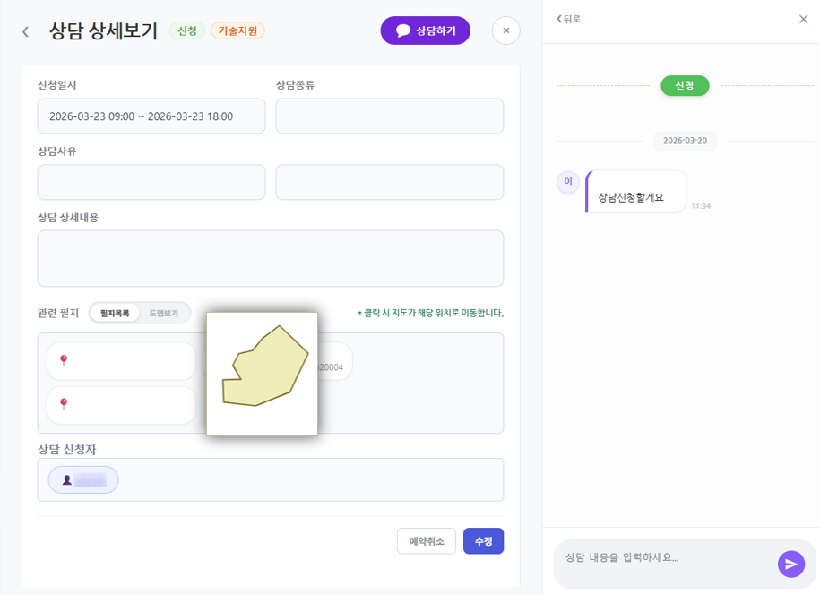

# 10년 이상된 국가 행정 시스템의 UI/UX 개선 사례

10년 이상 운영된 국가 행정 시스템에 최신 웹 기술과 UI/UX 패턴을 접목하여, 성능과 사용성을 동시에 개선한 사례입니다.
기존 레거시 환경의 한계를 극복하고, 실사용자 중심의 인터페이스와 현대적 개발환경을 도입했습니다.

# 국가 행정 시스템 UI/UX 개선 예시 ✨

이 리포지토리는 10년 이상 운영된 레거시 행정 시스템의 화면을
실사용자(주요 대상: 40대~60대)를 위해 재설계한 사례입니다.
핵심 목표는 ‘거부감 없는 UI’와 ‘직관적 지도 상호작용’입니다.

> 참고: README의 스크린샷은 로컬 `images/` 폴더의 `before_1..3`, `after_1..3`을 사용합니다. 📷

---

## 핵심 요약 ✅
- 대상: 레거시 행정 시스템의 상담관리 및 지도 기반 기능
- 주요 사용자: 40대 ~ 60대(현업 담당자 중심)
- 목적: 사용성 저항 최소화 → 업무 효율화 및 오류 감소
- 핵심 기법: 대화형 인터페이스(챗형 상담), OpenLayers 지도 선택, 리포트 자동화

## 주요 기능 🧭
- 대화형 상담관리 UI: 간단한 문장 입력으로 업무 흐름 유도
- 지도 기반 필지 선택: 시각적 선택으로 오류 감소
- 운영 리포트 자동 생성: 반복 업무 자동화로 시간 절감
- 성능 가이드: PL/SQL 튜닝 및 쿼리 최적화 예시

## 빠른 시작 ▶️
1. Java 11+ 및 Maven 설치
2. 프로젝트 루트에서 빌드:

```bash
mvn clean package
```

3. 샘플 DB/설정은 `resources/`의 샘플 파일을 확인하세요.

---

## Before & After (스크린샷) 📷

아래 갤러리는 실제 스크린샷을 통해 ‘어떻게 바뀌었는지’ 한눈에 보여줍니다.

<table>
  <tr>
    <th align="center">Before (기존)</th>
    <th align="center">After (개선)</th>
  </tr>
  <tr>
    <td align="center" valign="top">
      <br/>
      <small>텍스트·표 중심의 복잡 화면</small>
      <br/><br/>
      <br/>
      <small>중첩 폼과 긴 목록</small>
      <br/><br/>
      <br/>
      <small>지도 미연동 상태</small>
    </td>
    <td align="center" valign="top">
      <br/>
      <small>대화형 상담 + 핵심 정보 요약</small>
      <br/><br/>
      <br/>
      <small>간결한 필터 · 단축 액션</small>
      <br/><br/>
      <br/>
      <small>지도 기반 직접 선택</small>
    </td>
  </tr>
</table>

> 이미지 파일: `images/before_1.png` ~ `images/after_3.png`

---

## 디자인 원칙 (특히 40–60대 사용자에 집중) 🎯

- 큰 텍스트와 충분한 간격: 기본 `font-size`를 16–18px 이상으로 유지
- 버튼·컨트롤은 최소 44–48px 높이로 하여 터치/클릭 실수 감소
- 명확한 레이블과 단계적 흐름: 한 번에 한 일을 보여주는 Progressive Disclosure
- 색 대비(텍스트:배경) ≥ 4.5:1 권장으로 가독성 확보
- 오류는 친절하게 안내(예: '무엇이 잘못됐는지', '다음 단계는?')
- 시각적 단서 사용: 아이콘+텍스트 조합으로 의미 전달(이모지도 보조 수단)

이런 선택은 ‘디자인적 취향’이 아니라, 40–60대 실사용자의 사용성 저항을 낮추고
빠르게 업무에 적응하도록 돕기 위한 실무적 결정입니다. ✅

## 권장 디자인 토큰 (간단한 예)

```css
:root {
  --font-size-base: 18px;
  --line-height: 1.4;
  --button-min-height: 48px;
  --space-section: 24px;
  --accent-color: #2b7cff; /* 명확한 액센트 */
}
```

## 기여 및 라이선스
- 본 예시는 교육·포트폴리오 목적의 오픈소스 예시입니다. 수정은 PR 환영합니다.

---

> 문의: 프로젝트 구조나 샘플 데이터 제공 방법에 대해 도와드릴 수 있습니다.
