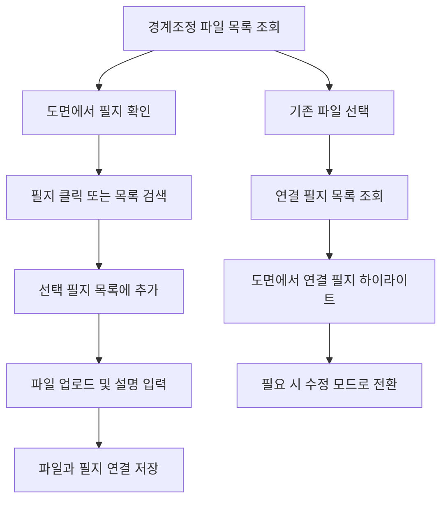
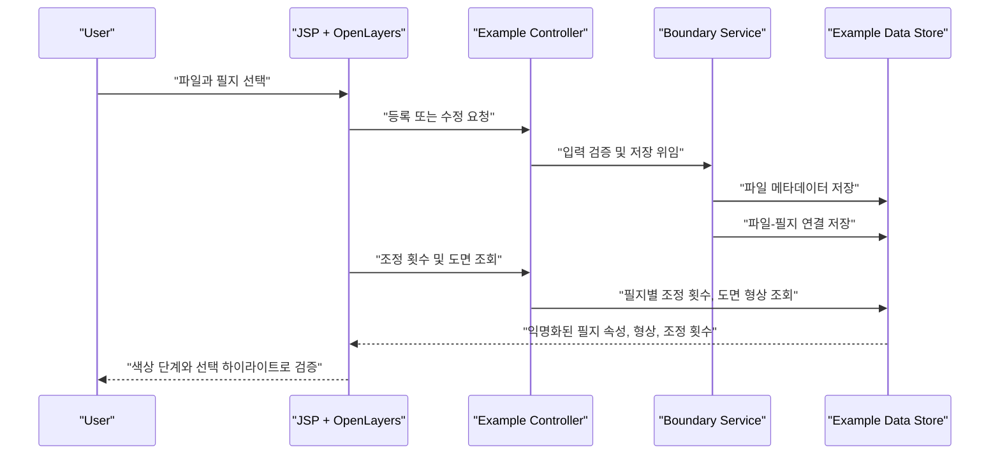
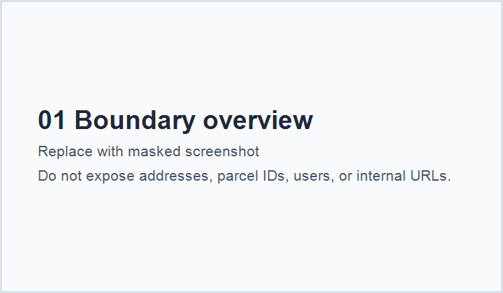
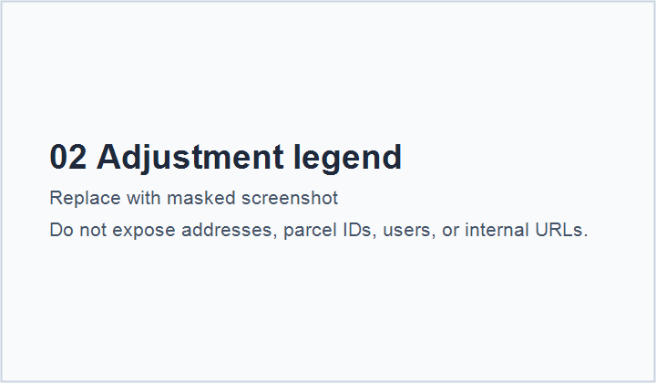
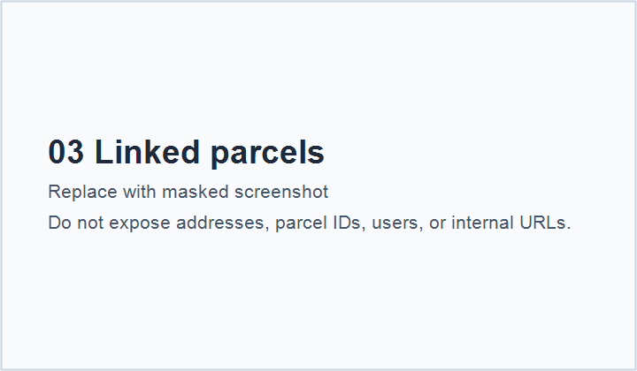
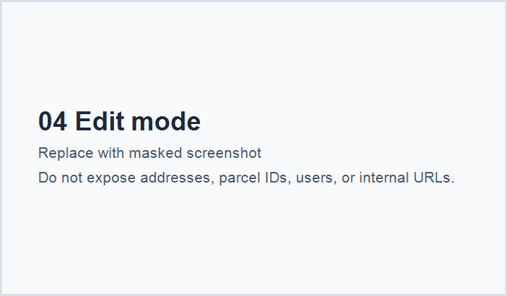

# Case 02. 경계조정 파일-필지 연계 검증

경계가 조정된 필지에 대해 파일과 필지를 함께 등록하고, 실제 필지별 조정 횟수를 도면 위에서 확인할 수 있게 만든 사례입니다.

이 기능의 핵심은 화면을 새롭게 꾸미는 것이 아니라, 기존 공공 행정 시스템의 제약 안에서 사용자가 "이 파일이 어떤 필지와 연결되어 있는지", "해당 필지가 몇 번 조정되었는지", "도면상 위치가 맞는지"를 한 화면에서 검증할 수 있게 하는 것입니다.

## 리뷰 요약

| 항목 | 내용 |
| --- | --- |
| 업무 문제 | 경계조정 파일과 실제 필지 연결 상태를 별도 목록과 도면을 오가며 확인해야 했음 |
| 사용자 리스크 | 잘못된 파일-필지 연결, 조정 이력 누락, 도면 확인 누락 가능성 |
| 시스템 제약 | 기존 JSP/jQuery 화면, 공통 테이블 UI, OpenLayers 지도 모듈, 권한/감사 로그, 기존 파일 저장 구조 유지 |
| 개선 방향 | 파일 등록, 필지 선택, 도면 하이라이트, 조정 횟수 시각화를 하나의 검증 흐름으로 연결 |
| 공개 방식 | 원본 식별자 제거 후 역할 중심 문서와 익명화 코드만 공개 |

## 제약 조건

전체 시스템 UI를 마음대로 재설계할 수 없는 조건이었습니다. 공통 CSS와 기존 업무 화면 패턴을 유지해야 했고, 현업 사용자가 이미 익숙한 표 기반 입력 방식도 깨기 어려웠습니다.

따라서 이 사례에서는 새로운 디자인 시스템을 도입하기보다 다음 판단을 우선했습니다.

- 기존 등록 폼과 목록 구조는 유지하되, 지도와 선택 필지 목록을 같은 시야에 배치
- 조회, 등록, 수정 상태를 명확하게 표시해 잘못된 저장을 방지
- 파일을 선택하면 연결된 필지를 도면과 목록에 동시에 표시
- 필지별 조정 횟수를 색상 단계로 표현해 검토 우선순위를 빠르게 판단
- 투명도 조절을 제공해 기존 도면 판독을 방해하지 않도록 처리

## 사용자 흐름

## 구현 구조

| 계층 | 책임 |
| --- | --- |
| JSP / JavaScript | 지도 초기화, 필지 선택/해제, 목록 렌더링, 등록/조회/수정 모드 관리 |
| Controller | 파일 업로드, 필지 목록 조회, 조정 횟수 조회, 저장/삭제 요청 진입점 |
| Service | 파일 저장과 필지 연결 저장의 트랜잭션 흐름, 입력값 정규화 |
| Repository / Mapper | 익명화된 파일 메타데이터, 파일-필지 연결, 도면 형상, 조정 횟수 조회 |
| Map Layer | 이전/확정 경계 도면을 읽어 색상, 라벨, 선택 상태로 표현 |

## 데이터 흐름

## 화면 검토 포인트

| 화면 요소 | 의도 |
| --- | --- |
| 등록/조회/수정 모드 배지 | 현재 작업 상태를 명확히 보여 저장 실수 방지 |
| 선택 필지 목록 | 도면에서 선택한 필지를 표로 재확인 |
| 도면 하이라이트 | 목록과 실제 경계 위치를 연결해 검토 |
| 조정 횟수 범례 | 조정이 반복된 필지를 우선 검토할 수 있게 지원 |
| 투명도 조절 | 색상 시각화가 기존 도면 판독을 가리지 않도록 보정 |
| 전체보기 지도 | 작은 업무 패널 안에서도 상세 위치를 확인할 수 있게 지원 |

## 스크린샷 갤러리

이미지는 공개 전 주소, 필지번호, 사용자명, 내부망 URL이 보이지 않도록 마스킹한 뒤 아래 파일명으로 추가합니다.

<table>
  <tr>
    <th align="center">전체 화면</th>
    <th align="center">조정 횟수 범례</th>
  </tr>
  <tr>
    <td align="center" valign="top">
       
      <small>파일 등록, 도면, 선택 필지 목록을 함께 확인</small>
    </td>
    <td align="center" valign="top">
       
      <small>조정 횟수 색상 단계와 투명도 조절</small>
    </td>
  </tr>
  <tr>
    <th align="center">연결 필지 확인</th>
    <th align="center">수정 모드</th>
  </tr>
  <tr>
    <td align="center" valign="top">
       
      <small>등록 파일 선택 시 연결 필지를 목록과 도면에 표시</small>
    </td>
    <td align="center" valign="top">
       
      <small>기존 파일의 연결 필지 목록을 수정</small>
    </td>
  </tr>
</table>

## 공개용 소스

| 파일 | 설명 |
| --- | --- |
| [source-sanitized/java/BoundaryAdjustmentController.java](source-sanitized/java/BoundaryAdjustmentController.java) | 공개용 컨트롤러 구조 |
| [source-sanitized/java/BoundaryAdjustmentService.java](source-sanitized/java/BoundaryAdjustmentService.java) | 파일-필지 연결 저장 흐름 |
| [source-sanitized/java/BoundaryAdjustmentRepository.java](source-sanitized/java/BoundaryAdjustmentRepository.java) | 데이터 접근 책임 예시 |
| [source-sanitized/mapper/BoundaryAdjustmentMap.xml](source-sanitized/mapper/BoundaryAdjustmentMap.xml) | 익명화된 SQL 매퍼 예시 |
| [source-sanitized/web/boundary-adjustment.jsp](source-sanitized/web/boundary-adjustment.jsp) | 지도 선택과 모드 전환 중심의 JSP/JS 구조 |

## 후속 개선 여지

현재 사례는 기존 시스템 제약 안에서 구현한 개선입니다. 제약이 완화된다면 다음 개선을 검토할 수 있습니다.

- 지도, 파일 등록, 선택 필지 목록을 독립 컴포넌트로 분리
- 등록/조회/수정 모드를 명시적인 상태 머신으로 관리
- 필지 선택 이벤트와 저장 요청에 대한 프론트엔드 테스트 추가
- 조정 횟수 색상 기준을 운영 설정으로 분리
- 키보드 접근성과 스크린리더 레이블 보강

## 익명화 메모

이 문서와 공개용 소스는 실제 운영 테이블명, API명, 업무 코드, 패키지명, 필지 고유번호, 내부 지도 유틸명을 포함하지 않습니다. 공개 기준은 [../../docs/security-redaction.md](../../docs/security-redaction.md)를 따릅니다.
