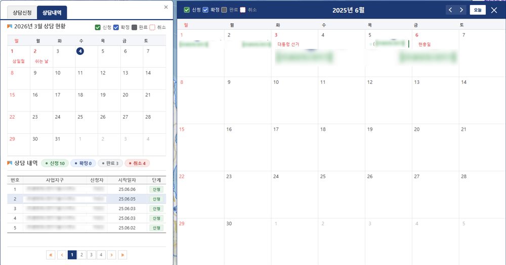
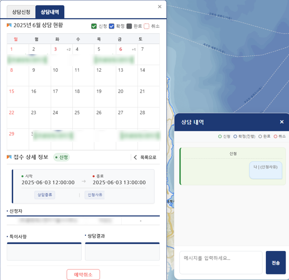
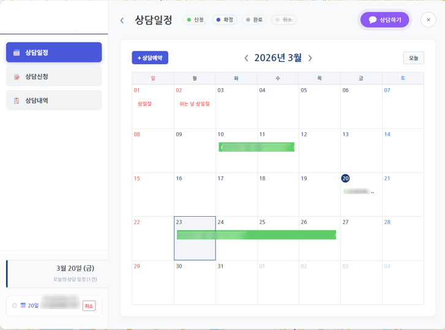
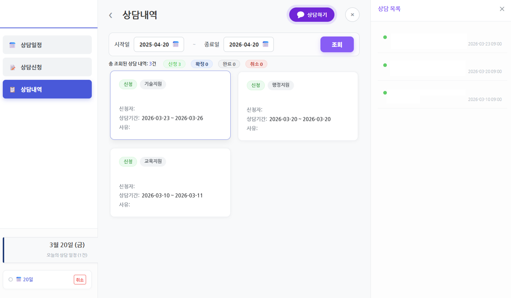

# Case 01. 상담관리 및 지도 선택 흐름 개선

레거시 행정 시스템의 상담관리 화면과 지도 기반 필지 선택 흐름을 정리한 사례입니다. 기존 사용자의 업무 습관을 크게 흔들지 않으면서 상담 내용 확인, 핵심 정보 접근, 지도 선택 흐름을 더 명확하게 만드는 데 초점을 두었습니다.

## 리뷰 요약

| 항목 | 내용 |
| --- | --- |
| 문제 | 표와 중첩 폼 중심 화면에서 상담 흐름과 지도 선택 맥락이 분리됨 |
| 제약 | JSP/Java 기반 화면, 기존 공통 CSS, 현업 사용자의 익숙한 조작 방식 유지 필요 |
| 개선 | 상담 핵심 정보를 더 빨리 파악하고 지도 선택 흐름으로 자연스럽게 이어지도록 정리 |
| 공개 범위 | 스크린샷과 익명화된 소스 구조만 포함 |

## Before & After

<table>
  <tr>
    <th align="center">Before</th>
    <th align="center">After</th>
  </tr>
  <tr>
    <td align="center" valign="top">
       
      <small>텍스트와 표 중심의 복잡 화면</small>
        
       
      <small>중첩 폼과 긴 목록</small>
        
       
      <small>지도 흐름이 업무 화면과 분리된 상태</small>
    </td>
    <td align="center" valign="top">
       
      <small>상담 맥락과 핵심 정보 요약</small>
        
       
      <small>간결한 필터와 단축 액션</small>
        
       
      <small>지도 기반 직접 선택</small>
    </td>
  </tr>
</table>

## 설계 판단

- 기존 테이블형 화면의 인지 구조를 완전히 버리지 않고, 사용자가 이미 알고 있는 조작 위치를 유지했습니다.
- 지도 선택 기능은 별도 도구처럼 보이지 않도록 상담 흐름과 연결했습니다.
- 폼 입력 오류를 줄이기 위해 사용자가 직접 좌표나 식별자를 입력하는 상황을 최소화했습니다.
- 화면의 미적 변화보다 업무 중 확인해야 하는 정보의 우선순위를 재정렬했습니다.

## 공개용 소스

`source-sanitized/`는 원본 시스템 코드가 아니라 구조 설명용 파일입니다. 실제 테이블명, API명, 패키지명, 업무 코드는 제거되어 있습니다.
